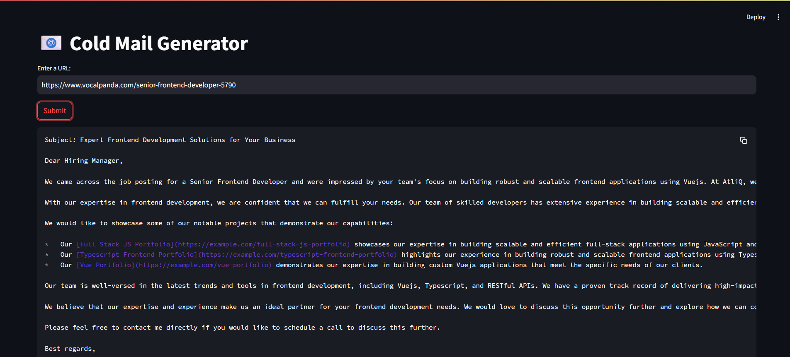

# 📧 Automated Cold Email Generator

An AI-powered tool that generates personalized cold emails for job outreach. It takes your **expertise/portfolio dataset** and the **job description from a hiring company**, analyzes both using local embeddings and a language model, and crafts a compelling email asking the company to consider hiring you.

---

## 🔍 Features

- 🧠 **Local LLM**: Uses a locally hosted language model (e.g. LLaMA 3) to generate high-quality, contextual email content.
- 📚 **ChromaDB Vector Store**: Stores and retrieves relevant portfolio chunks and job description insights using vector embeddings.
- ✉️ **Email Drafting**: Outputs a professional, human-like email based on your experience and the target job description.
- 📂 **Input Flexibility**: Accepts plain text or documents (PDF, TXT, etc.) for both your profile and the company job post.

---

## 📦 Tech Stack

- **Language Model**: Local LLM (e.g., LLaMA3, Mistral, etc.)
- **Vector Database**: [ChromaDB](https://www.trychroma.com/)
- **Embedding Model**: Local or remote embedding model (e.g., `InstructorXL`, `text-embedding-ada-002`)
- **Frontend (Optional)**: CLI or Web UI (e.g., Streamlit or FastAPI)

---

## 🚀 How It Works

1. **Load Portfolio**: Your portfolio/resume is chunked and embedded, then stored in ChromaDB.
2. **Ingest Job Description**: Job post text is embedded and compared with your portfolio.
3. **RAG Pipeline**: Retrieves relevant portfolio sections and job keywords.
4. **LLM Generation**: Prompts the local LLM to generate a personalized cold email.
5. **Output**: Clean, ready-to-send email draft.

---

## 📁 Example Email Output

